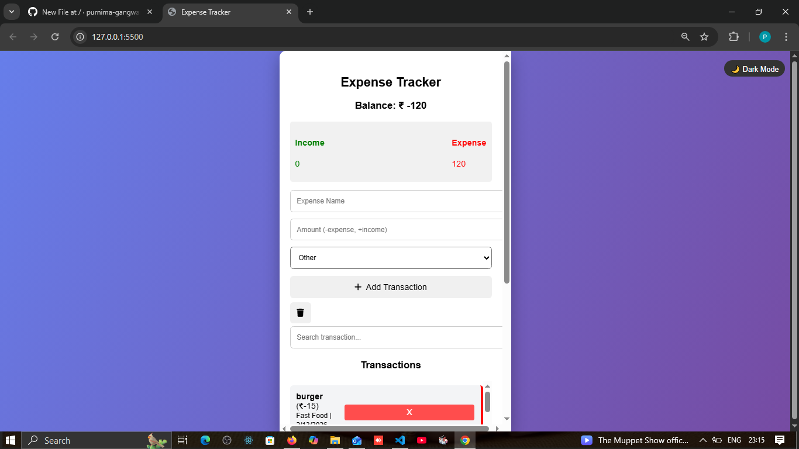
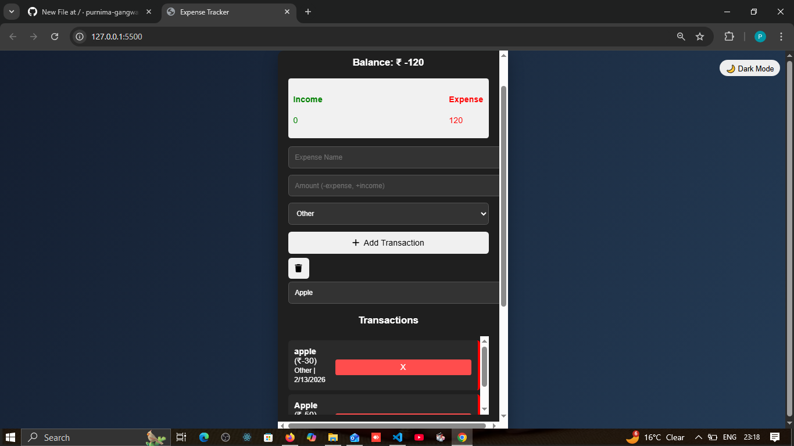
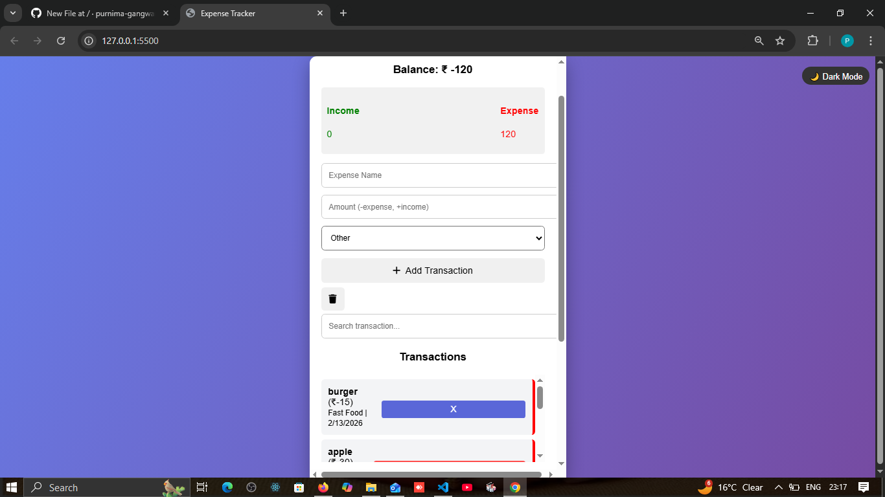
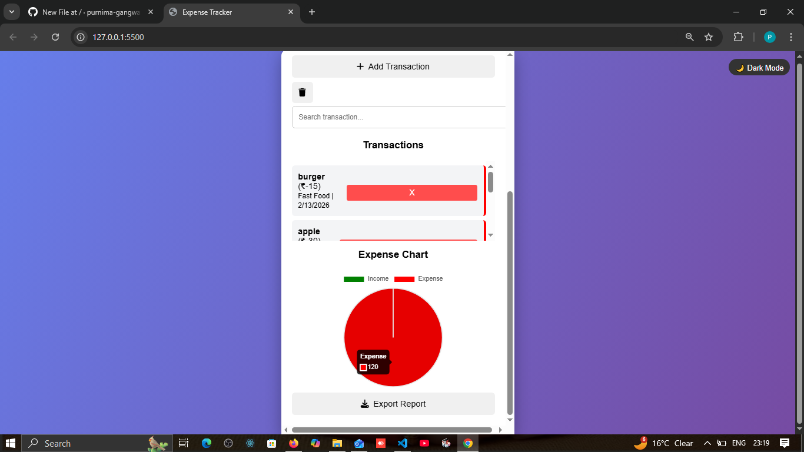
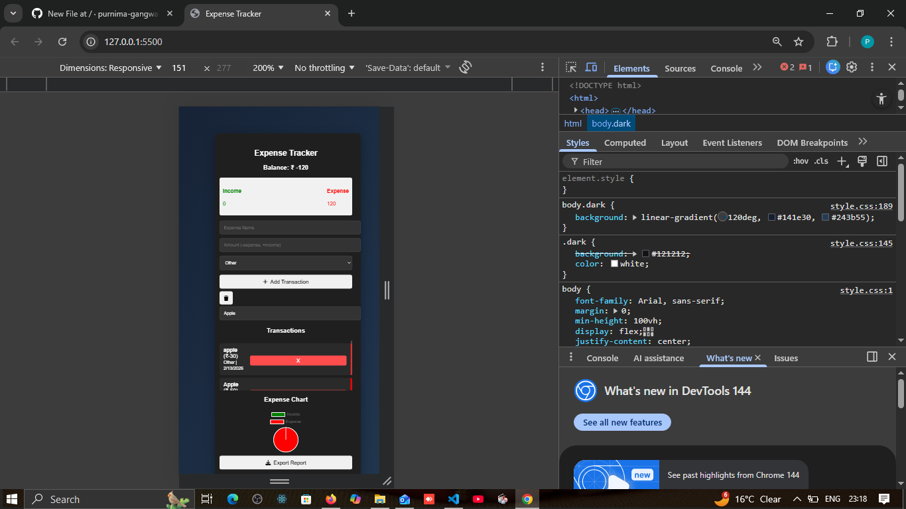
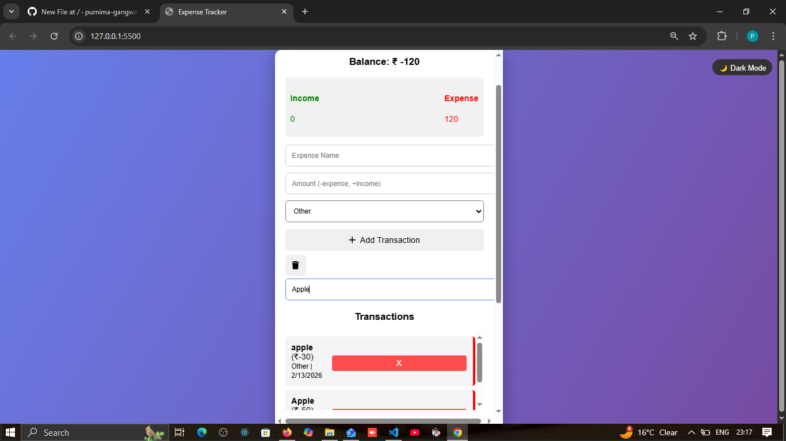
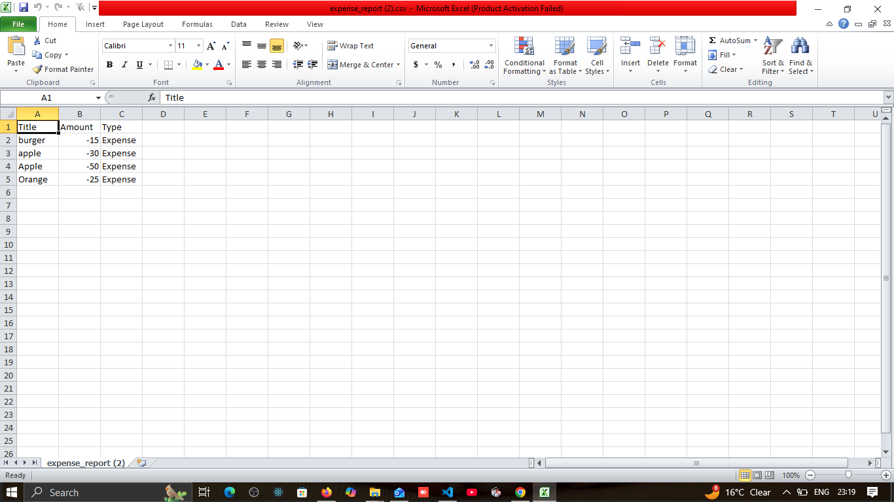

# 💰 Expense Tracker Web App

A simple and responsive Expense Tracker web application built using HTML, CSS, and JavaScript.  
Users can add income and expenses, view balance updates, and download transaction reports.

---

## 🚀 Features

- Add Income & Expenses
- Automatic Balance Calculation
- Income & Expense Summary
- Transaction History List
- Delete Transactions
- Expense Chart Visualization
- Export Report (CSV Download)
- Dark Mode Toggle
- Mobile Responsive Design

---

## 🛠️ Technologies Used

- HTML5
- CSS3
- JavaScript
- Chart.js
- Local Storage for saving data

---

## 📂 Project Structure

expense-tracker/
│
├── index.html
├── style.css
├── script.js
├── README.md
└── screenshots/
---

## 📸 Screenshots

---

## ⚙️ How to Run Project

1. Download or clone the repository
2. Open project folder
3. Open 'index.html' in browser

---

## 📌 Future Improvements

- Login & User Accounts
- Monthly Expense Reports
- Category-wise Analysis
- Cloud Database Storage
  

---

## 👩‍💻 Author

**Purnima Gangwar**

